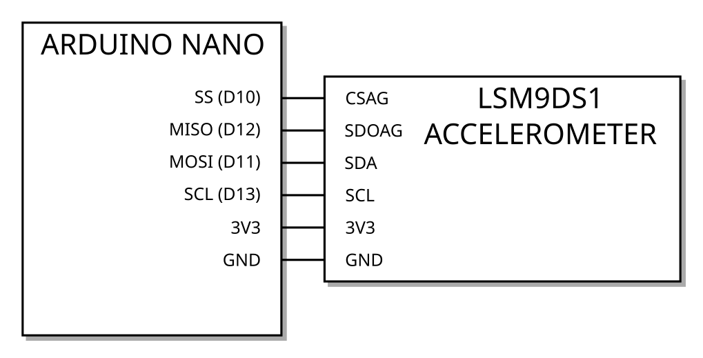
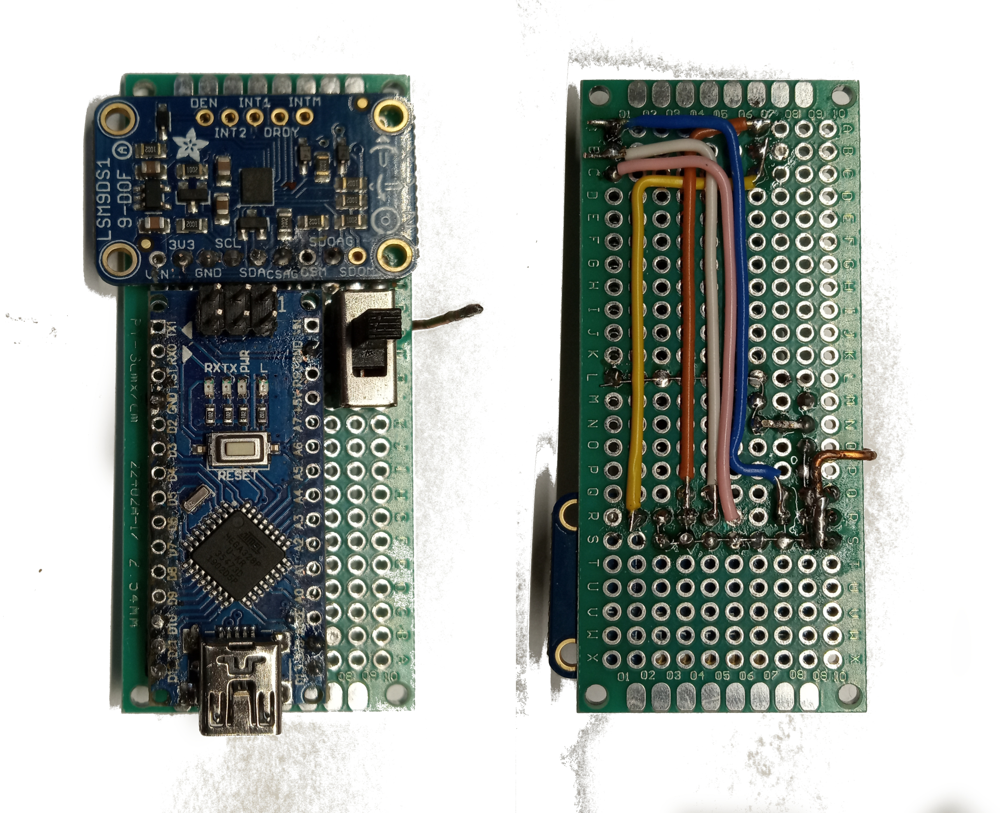
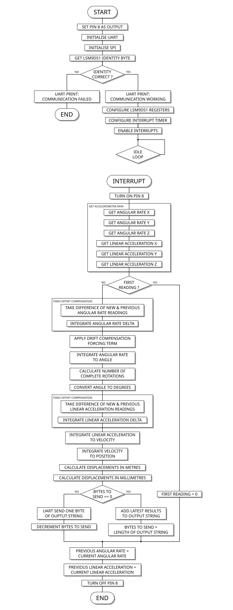

# Localisation using a low-cost 6 axis accelerometer

---

The purpose of this project is to assess the feasibility of using the data from a cheap MEMS accelerometer IC like the LSM9DS1 to track the position and orientation of an object in 3D space.

The code has been written for the ATmega328p microcontroller and the Adafruit LSM9DS1 accelrometer and gyroscope module (https://learn.adafruit.com/adafruit-lsm9ds1-accelerometer-plus-gyro-plus-magnetometer-9-dof-breakout).

## Dependencies, building and flashing

**You will need the following programs:**

- avr-gcc
- avr-objcopy
- avrdude

**To compile, run:**

    avr-gcc -Wall -Os -mmcu=atmega328p -o prog.o AV_SPI.cpp AV_USART.cpp string_handling.cpp main.cpp

`AV_SPI.cpp`, `AV_USART.cpp` and `string_handling.cpp` are libraries that I have written to handle SPI communication, serial communication and some number to string conversion tasks. They must be compiled along with the main program.

`main.cpp` is the latest finished version of the program. Replace with `phase_1.cpp`, `phase_2.cpp`... etc to try out earlier iterations.

Replace prog.o with whatever name you want for the compiled object file.

**To generate a hex file:**

    avr-objcopy -O ihex prog.o prog.hex

Where prog.o is your object file and prog.hex the name of your output hex file.

**To flash to the microcontroller:**

    avrdude -v -c avrisp -p ATMEGA328P -b 19200 -P /dev/ttyUSB3 -U flash:w:prog.hex

Replace **"/dev/ttyUSB3"** with the path to the port where your programmer is connected.

Change "avrisp" to the name of your programming device if you are not using an AVR ISP programmer.

Use the "-b" option to adjust the programmer baud rate if you need to.

---

## Project Brief

### Bacground:

Through past experiments with model rockets as a hobby I have often desired an inexpensive way of tracking the position of a rocket in 3D space. 

While commercial flight data recorders certainly exist they are often geared more toward simply measuring altitude and flight time. Some systems utilise GPS to track position, however the kind of cheap GPS modules available to the public only have an accuracy of 3-4m and a maximum update rate of approximately 10Hz.

For this project I wanted to see if it was possible to get reliable information about orientation and position by integrating the readings from a cheap MEMS accelerometer module.

The device that I have chosen to use is the LSM9DS1 manufactured by "ST Microelectronics". It contains a 3-axis accelerometer, measuring linear acceleration in *x*, *y* and *z*, and a 3-axis "gyroscope", measuring angular rate / angular velocity in around each of the 3 axes.

Measurements can be requested from the device either via SPI or I2C. I have chosen to use the SPI interface for higher data rates.

### Required features:

- Routines to communicate with the LSM9DS1 via SPI.
- Routines to set the chip into the correct measurement modes.
- Integration of the angular rate data to get an angle around each axis.
- Double integration of the linear acceleration data to get a position in each axis.
- A timed interrupt that will allow data to be sampled from the chip at regular intervals, enabling accurate integration of the data.
- Routines to convert the numerical results to strings that can be sent over the serial port.
- Routines to send data over the USART serial port.
- A client software that will read the serial data on a PC and possibly produce a 3D plot of the position and orientation of the accelerometer module. 

## Design

For this project I have used the "Adafruit" LDM9DS1 accelerometer module and an ATmega328p microcontroller in the form of an "Arduino Nano" clone to gather the data and perform all of the calculations.

The microcontroller and accelerometer are connected according to this circuit diagram:
    

Here is a picture of the two connected together on some prototyping board:
    

### Accelerometer module configuration:

Both the accelerometer and gyroscope are set for an output data rate of 952 Hz.

All of the internal filtering is disabled so that only the raw data is used. It may turn out to be useful to re-enable some of this filtering in the future if the data is too noisy.

The accelerometer and gyroscope each produce 3 two's complement signed 16-bit integers. One for each axis. The gyroscope is configured for +- 500 degrees per second (dps) full scale. The accelerometer is configured for +- 4g (+- 39.24 ms^-2) full scale.

### Software architecture:

For the integration to work well, and to be able to track fine changes in position and angle, samples need to be gathered from the accelerometer as fast as possible. Samples can potentially be taken up to the maximum data rate at which the accelerometer module is generating them, 952 Hz, however there is a trade off.

The UART serial communication with the PC is relatively slow and there is quite a lot of data that needs to be sent, angle in 3 axes and position in 3 axes. To send all of the data for each sampling interval in full would take many tens of miliseconds, making the integration loop much too slow.

Instead I have chosen to run a reasonably fast 500 Hz integration loop on the microcontroller and send over the UART only a subset of the result values at a slower rate. This is achieved by interleaving the process of sampling and of sending data.

Results for the three positions and angles are being continuously calculated and updated at 500 Hz. The latest set of results is added to an output string. The bytes in this string are shifted out of the UART one at a time with each loop, until the string is empty. When empty the string is re-populated with the new latest results. This way sending the data never slows down the integration loop.

Below is a flow diagram showing roughly the software architecture:
    

The purpose of toggling pin 8 at the start and end of the interrupt service routine is to allow the percentage of the 2 ms interrupt period that is utilised to be measured on an oscilloscope.

### Programing techniques used:

- Conditional statements.
- Loops.
- Subroutines.
- Pointers.
- Modularity using separate program files and header files.
- interrupt service routines.
- Classes.
- Operator overloading.

## Implementation

***Disclaimer:** I am well aware that for some of the routines and libraries I have written, there already exist "off the shelf" implementations that I could have used. I have written my own for fun, practice and for my own education.*

For the main program code see: [main code](https://github.com/Arthur-Vie/ELEC1620-project/blob/master/phase_5.cpp)

For this project I have implemented three additional libraries:

- [AV_SPI.cpp](https://github.com/Arthur-Vie/ELEC1620-project/blob/master/AV_SPI.cpp) ([AV_SPI.h](https://github.com/Arthur-Vie/ELEC1620-project/blob/master/AV_SPI.h)) provides all of the methods I need for sending and recieving data via SPI.
- [AV_USART.cpp](https://github.com/Arthur-Vie/ELEC1620-project/blob/master/AV_USART.cpp) ([AV_USART.h](https://github.com/Arthur-Vie/ELEC1620-project/blob/master/AV_USART.h)) provides methods for sending bytes and also sending whole strings or blocks of data over the UART serial port.
- [string_handling.cpp](https://github.com/Arthur-Vie/ELEC1620-project/blob/master/string_handling.cpp) ([string_handling.h](https://github.com/Arthur-Vie/ELEC1620-project/blob/master/string_handling.h)) contains a routines for converting signed 16-bit integers into text strings and inserting them into other strings.

embedded below is a brief video demonstrating the functionality so far:
    <video></video>
    

## Reflection on the ELEC1620 module

Before starting my degree at Leeds I worked for several years at the National Physical Laboratory where I was responsible for designing and implementing several embedded systems (here's an example of one of mine: https://www.npl.co.uk/instruments/at-k-radiation-thermometer)
As a result the content of this module was mostly a revision of topics I had covered before.

My experience in programming is mostly with pure C, so for this project I have attempted to push my knowledge and learn some more C++ concepts.

I have been able to use classes and operator overloading for my project, both of which are powerful object-oriented techniques that I was only tangentially aware of before. I have also practiced and challenged my skills by attempting to run my project on the actual hardware.

---

## Further Details

So far the project is working well enough that I am able to generate values the orientation of the device in all three axes (angle in degrees and number of rotations). This is a partial success, however there are a number of other problems that have arisen which I still need to find solutions for. The main ones are listed below:
 
- ### Integrator drift:

    The angular rate measurements from the accelerometer module unfortunately suffer from some amount of static offset error (i.e. the module generates a non zero angular rate even when no rotation is occurring). In order to remove these offsets I first take the difference between successive readings (derivative) over the 2 ms time period, before accumulating them again (integrating) into a corrected angular rate value. 

    The limitation of this method is that, if the angular rate increases and then reduces again back to zero, the value may not return exactly to zero (there is always some error in the integrated value, since the integration period is not zero).
    This results in some small offset that will cause the angle reading to drift very slowly over time even if the module is not moving.

    My solution to this has been to add a small forcing term to the angular rate value which is inversely proportional to the size of the value and acts to null out any offset if the offset is very small. This method works in eliminating the drift but introduces a secondary problem. Even if the forcing value is quite small it will create some error in the accumulated angular rate. This leads to the angle values becoming hysteretic (i.e. if you rotate the module by 90 degrees and them back to zero the angle value will not return exactly to zero).

    This introduces a tradeoff between drift and hysteresis. I have attempted to adjust the algorithm for the offset correction to minimise both as best as I can, but there may be ways that this problem can be improved.s

- ### Calculating accelerations in world space

    To be able to calculate the position of the device in 3D space I need to know the accelerations that the device experiences in a global coordinate system, However the linear acceleration values generated by the accelerometer module are in its own frame of reference. i.e. the *x*, *y* and *z* accelerations are relative to the *x*, *y* and *z* axes of the physical chip, which will of course change as the device is rotated. This presents the problem of somehow converting the acceleration values from the chips local coordinate system to some local coordinate system.

    Thankfully if sufficiently accurate and repeatable values for the devices angle can be generated then this may be possible. If the device is assumed to start in a known orientation relative to the global coordinate system then the angle values in each axis can be used to track how the orientation changes, and to updtate a transform that will convert the acceleration readings from the local to the global coordinates system.

- ### Acceleration due to gravity

    The LSM9DS2 is a MEMS device who's basic principle is that internally a microscopic cantilever etched into the silicon experiences a force as the device accelerates. This cantilever will deflect under the force by an amount proportional to the acceleration, and this deflection is what the chip measures (usually by electrostatic or capacitive methods). As a result the tiny cantilevers inside the device will always experience a deflection due to the force of gravity, manifesting it's self as a constant acceleration, the acceleration due to gravity.

    For the purposes of this project this static acceleration due to gravity is a problem. It would cause the device to appear as if it is constantly accelerating even when it is static. 
    
    Initially I thought a solution might be taking the difference of successive acceleration readings to cancel out the static offset. The problem with this method is that as the orientation of the device changes the component of acceleration due to gravity moves towards a different axis (say if the *x* axis now points down instead of *z*). Using a simple method of taking differences, any change in orientation would appear as a linear acceleration, even when none has occurred.

    A solution to this would be to use the angle data to track the direction of the gravitational vector and use a transform to subtract it's components from the linear acceleration values in each axis.

    ---

    ## License

     This work by <a xmlns:cc="http://creativecommons.org/ns#" href="https://github.com/Arthur-Vie/ELEC1620-project" property="cc:attributionName" rel="cc:attributionURL">Arthur Vie</a> is licensed under a <a rel="license" href="http://creativecommons.org/licenses/by-nc-sa/4.0/">Creative Commons Attribution-NonCommercial-ShareAlike 4.0 International License</a>.